# rn-design-system-starter

> React Native 0.85 디자인 시스템 스타터 — 31개 컴포넌트, 2-tier 토큰, 라이트/다크 자동 전환, 전역 Toast·Dialog·BottomSheet·Popup 호스트.

## Screenshots

갤러리는 카테고리별 화면으로 drill-down하며, 각 카테고리는 컴포넌트 단위 탭으로 구성됩니다 (한 컴포넌트의 모든 변형을 한 탭에서 비교).

### Gallery Home (갤러리 홈)
| Light | Dark |
|:---:|:---:|
| 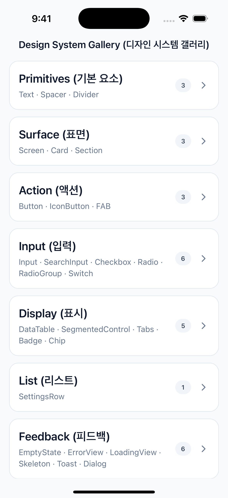 | 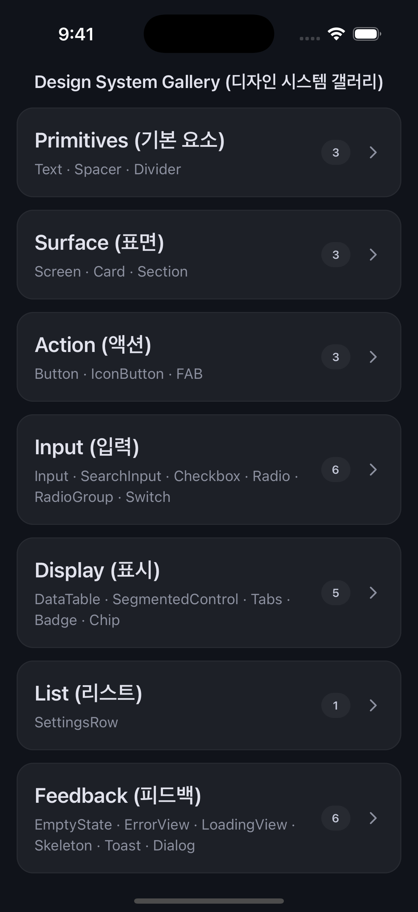 |

### Primitives — Text (텍스트)
| Light | Dark |
|:---:|:---:|
|  |  |

### Surface — Card (카드)
| Light | Dark |
|:---:|:---:|
|  |  |

### Action — Button (버튼)
| Light | Dark |
|:---:|:---:|
|  |  |

### Action — FAB (Floating Action Button)
| Light | Dark |
|:---:|:---:|
|  |  |

### Input — Input (입력)
| Light | Dark |
|:---:|:---:|
|  |  |

### Input — Checkbox (체크박스)
| Light | Dark |
|:---:|:---:|
|  |  |

### Input — Radio (라디오 + 그룹)
| Light | Dark |
|:---:|:---:|
|  |  |

### Input — Switch (스위치)
| Light | Dark |
|:---:|:---:|
|  |  |

### Display — DataTable (데이터 테이블)
| Light | Dark |
|:---:|:---:|
|  |  |

### Display — SegmentedControl (분할 컨트롤)
| Light | Dark |
|:---:|:---:|
|  |  |

### Display — Tabs (탭)
| Light | Dark |
|:---:|:---:|
|  |  |

### Display — Badge (배지)
| Light | Dark |
|:---:|:---:|
|  |  |

### Display — Chip (칩)
| Light | Dark |
|:---:|:---:|
| 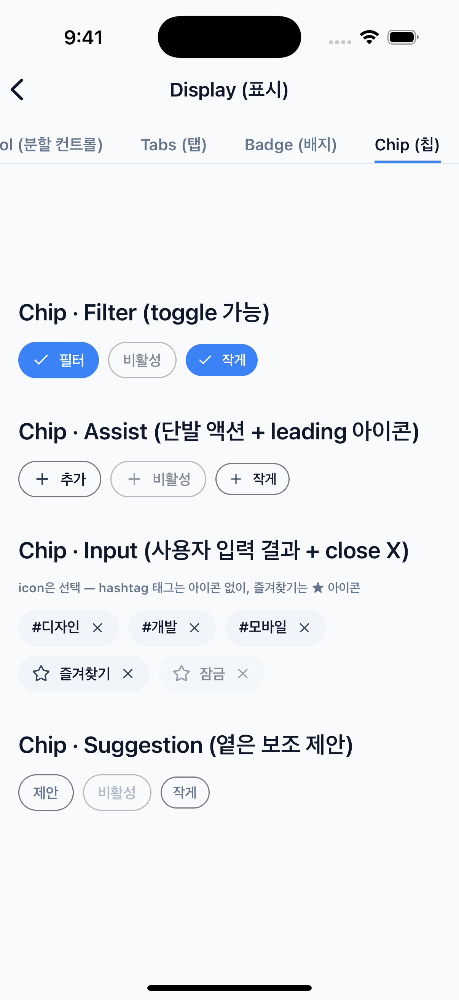 | 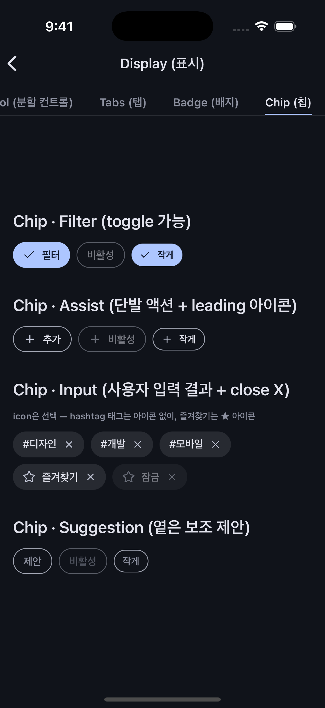 |

### List — SettingsRow (설정 행)
| Light | Dark |
|:---:|:---:|
|  |  |

### Feedback — Skeleton (스켈레톤)
| Light | Dark |
|:---:|:---:|
| 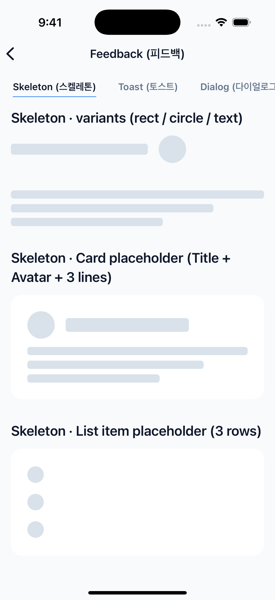 | 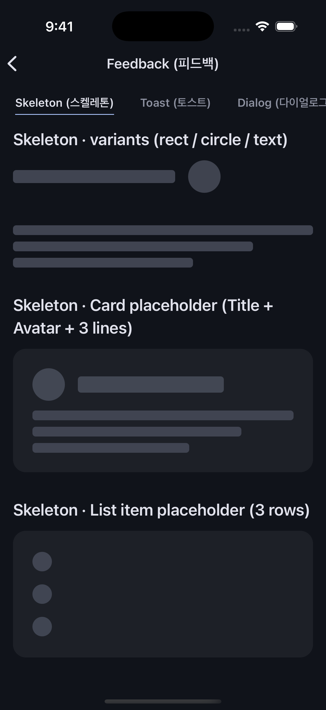 |

### Feedback — Progress (진행률)
| Light | Dark |
|:---:|:---:|
|  |  |

### Feedback — Toast (토스트)
| Light | Dark |
|:---:|:---:|
|  |  |

### Feedback — Tooltip (도구 설명)
| Light | Dark |
|:---:|:---:|
|  |  |

### Feedback — Dialog (다이얼로그)
| Light | Dark |
|:---:|:---:|
|  |  |

### Feedback — BottomSheet (단일 snap)
| Light | Dark |
|:---:|:---:|
|  |  |

### Feedback — BottomSheet (다중 snap)
| Light | Dark |
|:---:|:---:|
|  |  |

### Feedback — BottomSheet (Scrollable)
| Light | Dark |
|:---:|:---:|
|  |  |

### Feedback — BottomSheet (키보드)
| Light | Dark |
|:---:|:---:|
|  |  |

### Modal — Popup (RadioGroup 선택)
| Light | Dark |
|:---:|:---:|
| 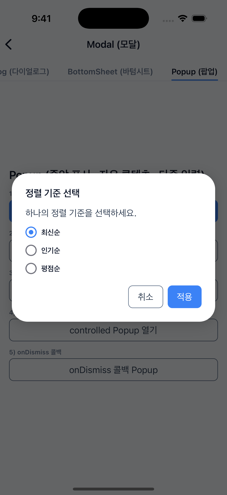 | 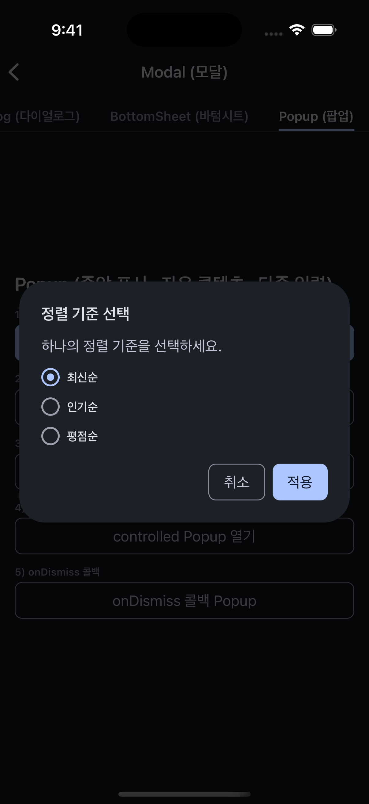 |

### Modal — Popup (Checkbox 다중 선택)
| Light | Dark |
|:---:|:---:|
| 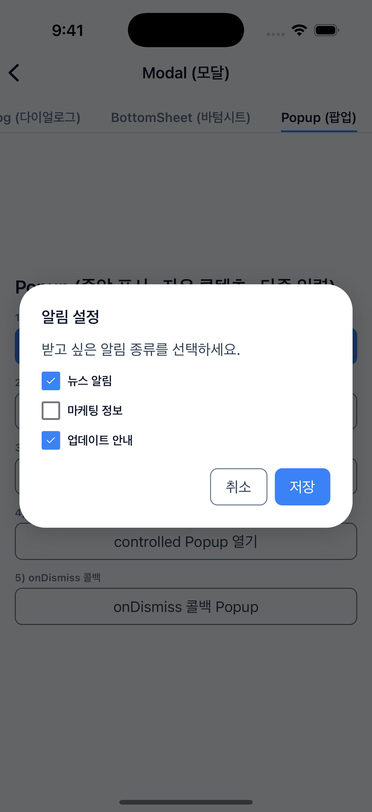 | 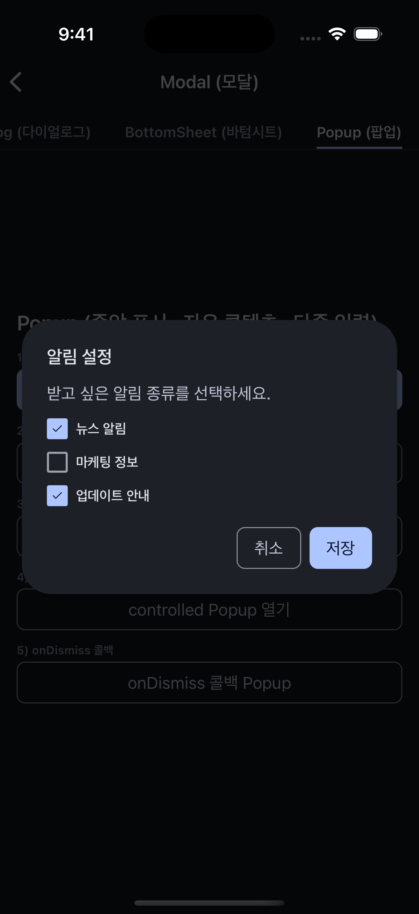 |

### Modal — Popup (다중 Input form)
| Light | Dark |
|:---:|:---:|
| 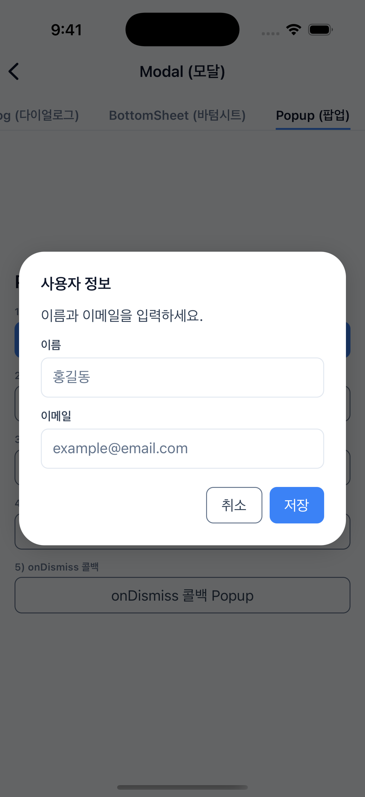 | 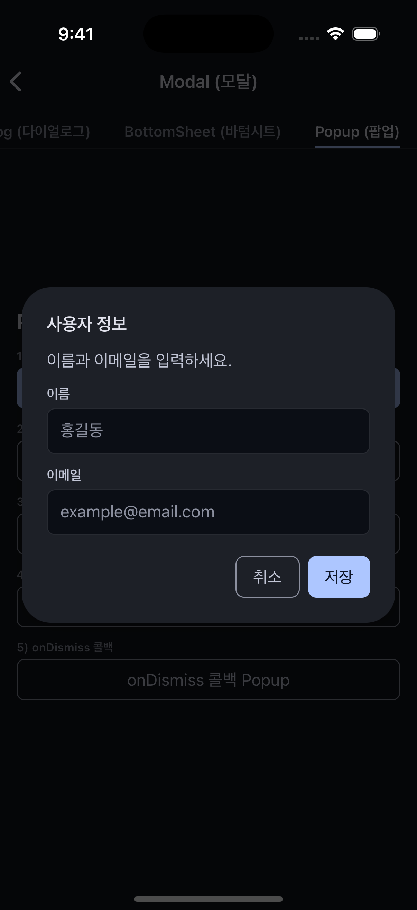 |

## Quick Start

```bash
git clone https://github.com/<your-account>/rn-design-system-starter.git
cd rn-design-system-starter
npm install
cd ios && pod install && cd ..
npm run ios      # 또는 npm run android
```

요구사항: Node.js 22.11+, Xcode 16+ (iOS), Android Studio + JDK 17+ (Android).

## 포함 컴포넌트 (31종, 7 카테고리)

| 카테고리 | 컴포넌트 | 설명 |
|---|---|---|
| **primitives** | `Text` | 텍스트 표시 |
| | `Spacer` | 요소 사이 간격 |
| | `Divider` | 영역을 나누는 구분선 |
| **surface** | `Screen` | 화면 전체를 감싸는 컨테이너 |
| | `Card` | 관련된 내용을 묶는 표면 |
| | `Section` | 페이지 안 영역을 구분하는 묶음 |
| **action** | `Button` | 사용자가 누르는 액션 버튼 |
| | `IconButton` | 아이콘만으로 누르는 액션 버튼 |
| | `FAB` | 화면 위에 떠 있는 주요 액션 버튼 |
| **input** | `Input` | 한 줄 텍스트 입력 |
| | `SearchInput` | 검색어 입력 + 지우기 |
| | `Checkbox` | 여러 항목을 다중 선택 |
| | `Radio` / `RadioGroup` | 여러 항목 중 하나만 선택 |
| | `Switch` | 켜고 끄기 |
| **display** | `DataTable` | 표 형태로 데이터 나열 + 정렬 |
| | `SegmentedControl` | 여러 옵션 중 하나를 가로 분할 형태로 선택 |
| | `Tabs` | 여러 화면을 탭으로 전환 |
| | `Badge` | 상태·개수·라벨 표시 |
| | `Chip` | 태그·필터·선택을 칩 형태로 표시 |
| **list** | `SettingsRow` | 설정 항목 한 줄 (값 표시·토글·이동·실행) |
| **feedback** | `EmptyState` | 표시할 내용이 없을 때 안내 |
| | `ErrorView` | 오류 상황 안내 + 재시도 |
| | `LoadingView` | 로딩 중 안내 |
| | `Skeleton` | 콘텐츠 로딩 중 자리 표시 |
| | `LinearProgress` / `CircularProgress` | 진행률 표시 (막대·원형) |
| | `Tooltip` | 컴포넌트 길게 누르면 짧은 설명 표시 |
| | `Toast` | 잠깐 떴다 사라지는 알림 |
| | `Dialog` | 화면 가운데 떠서 사용자 확인을 받는 창 |
| | `BottomSheet` | 화면 아래에서 올라오는 시트 (다중 snap · scrollable · 키보드 양립) |
| | `Popup` | 중앙 입력 모달 (RadioGroup · Checkbox · 다중 Input 자유 배치) |

## 기술 스택

| 영역 | 패키지 |
|---|---|
| **런타임** | React Native 0.85, React 19.2, TypeScript 5.8 |
| **스타일링** | styled-components/native 6.4 (DefaultTheme module augmentation) |
| **상태 관리** | Zustand 5 (Toast/Dialog 전역 호스트), TanStack Query 5 (서버 상태) |
| **네비게이션** | React Navigation 7 (`@react-navigation/native-stack`) — 예시 갤러리용 |
| **edge-to-edge** | `react-native-edge-to-edge` 1.8 (Android 15 status bar 통합) |
| **아이콘** | `lucide-react-native` 1.x + `react-native-svg` |
| **경로 별칭** | `babel-plugin-module-resolver` (`@/*` → `src/*`) |

## 사용 예시

### Text
```tsx
<Text variant="headlineMd" color="primary">최근 활동</Text>
<Text variant="bodySm" color="muted">2026-05-20</Text>
```

### Button
```tsx
<Button label="저장" variant="primary" onPress={handleSave} />
<Button label="삭제" variant="destructive" onPress={confirmDelete} />
```

### Card
```tsx
<Card title="개요" meta="이번 달" showDivider>
  <Text>카드 컨텐츠</Text>
</Card>
```

### Tabs
```tsx
import { Tabs } from '@/components/display';
import { Star } from 'lucide-react-native';

const TABS = [
  { value: 'all', label: '전체' },
  { value: 'stats', label: '통계', badge: 3 },                    // count badge (>99는 "99+" 자동)
  { value: 'favorites', label: '즐겨찾기', icon: <Star size={16} /> }, // leading 아이콘
  { value: 'archived', label: '보관함', disabled: true },          // 비활성 (onPress 차단 + opacity 0.5)
];

const [active, setActive] = useState('all');

<Tabs tabs={TABS} value={active} onChange={setActive} />
```

### Checkbox
```tsx
import { Checkbox } from '@/components/input';

const [agreed, setAgreed] = useState(false);

<Checkbox value={agreed} onValueChange={setAgreed} label="약관에 동의합니다" />
<Checkbox value={agreed} onValueChange={setAgreed} size="lg" />
<Checkbox value disabled />
```

### Radio
```tsx
import { Radio, RadioGroup } from '@/components/input';

type Plan = 'free' | 'pro' | 'team';
const [plan, setPlan] = useState<Plan>('pro');

<RadioGroup value={plan} onValueChange={setPlan}>
  <Radio value="free" label="Free" />
  <Radio value="pro" label="Pro" />
  <Radio value="team" label="Team" disabled />
</RadioGroup>
```

### Switch
```tsx
import { Switch } from '@/components/input';

const [dark, setDark] = useState(false);

<Switch value={dark} onValueChange={setDark} label="다크 모드" />
<Switch value={dark} onValueChange={setDark} size="lg" />
<Switch value disabled />
```

### Badge
```tsx
import { Badge } from '@/components/display';

<Badge type="dot" color="success" />
<Badge type="count" value={3} color="destructive" />
<Badge type="count" value={150} />        // → "99+" 자동
<Badge type="label" value="NEW" color="warning" />
```

### FAB
```tsx
import { Plus } from 'lucide-react-native';
import { FAB } from '@/components/action';

<FAB icon={<Plus />} accessibilityLabel="추가" onPress={openSheet} />
<FAB variant="small" icon={<Plus />} accessibilityLabel="추가" onPress={...} />
<FAB variant="large" icon={<Plus />} accessibilityLabel="새 항목" onPress={...} />
<FAB variant="extended" icon={<Plus />} label="글쓰기" onPress={...} />
```

### Skeleton
```tsx
import { Skeleton } from '@/components/feedback';

<Skeleton type="rect" width={200} height={16} />
<Skeleton type="circle" size={40} />
<Skeleton type="text" />                                  // 3 lines 기본
<Skeleton type="text" lines={2} lineWidths={['100%', '70%']} />
```

### Chip
```tsx
import { Plus, Star } from 'lucide-react-native';
import { Chip } from '@/components/display';

const [active, setActive] = useState(false);

<Chip variant="filter" label="필터" selected={active}
  onPress={() => setActive(s => !s)} />
<Chip variant="assist" label="추가" icon={<Plus />} onPress={...} />
<Chip variant="input" label="태그" icon={<Star />} onPress={...}
  onClose={() => removeTag()} />
<Chip variant="suggestion" label="제안" onPress={...} />
```

### Progress
```tsx
import { LinearProgress, CircularProgress } from '@/components/feedback';

// determinate (0~100, variant 생략 가능)
<LinearProgress value={50} />
<LinearProgress value={75} size="lg" />
<CircularProgress value={50} size="md" />

// indeterminate (변수 prop 명시)
<LinearProgress variant="indeterminate" />
<CircularProgress variant="indeterminate" size="sm" />
```

### Tooltip
```tsx
import { Tooltip } from '@/components/feedback';
import { Settings } from 'lucide-react-native';

// 자동 모드 (롱프레스 → 1500ms 자동 dismiss)
<Tooltip text="설정 메뉴">
  <IconButton icon={<Settings />} onPress={openSettings} accessibilityLabel="설정" />
</Tooltip>

// position 지정 (4방향)
<Tooltip text="삭제합니다" position="bottom">
  <IconButton icon={<Trash />} onPress={handleDelete} accessibilityLabel="삭제" />
</Tooltip>

// 외부 제어 (visible prop) — onboarding 시나리오
const [hint, setHint] = useState(true);
<Tooltip text="여기를 눌러보세요!" visible={hint}>
  <Button label="시작" onPress={onStart} />
</Tooltip>
```

#### 호환 children
Tooltip의 children은 `onLongPress` prop을 수용하는 element 필수:

| children 타입 | 호환 | 비고 |
|---|---|---|
| 라이브러리 인터랙티브 컴포넌트 (IconButton/Button/FAB/Chip/Switch) | ✓ | `InteractivePressableProps` Pick 상속(v1.x 7번째 표준 패턴)으로 자동 |
| RN `Pressable` | ✓ | 표준 onLongPress 수용 |
| RN `TouchableOpacity` | ✓ | 표준 onLongPress 수용 |
| 외부 라이브러리 컴포넌트 | ✓ | onLongPress prop 수용 시 |
| RN `View` (비-인터랙티브) | ❌ | RN Touch Responder System 본질 한계 — `Pressable`로 직접 wrap 후 사용 |

→ 비-인터랙티브 element wrap 시 권장 패턴: `<Tooltip><Pressable onPress={...}>{content}</Pressable></Tooltip>`. 갤러리 Tooltip sub-tab "라이브러리 종속성 검증 (3 케이스)" 섹션 참조.

## Toast & Dialog

### 마운트 (App 루트, 1회만)

```tsx
import { DialogHost, ToastHost } from '@/components/feedback';

export default function App() {
  return (
    <ThemeProvider theme={theme}>
      <SafeAreaProvider>
        <SystemBars style={isDark ? 'light' : 'dark'} />
        <NavigationContainer>
          <RootNavigator />
        </NavigationContainer>
        <DialogHost />
        <ToastHost />
      </SafeAreaProvider>
    </ThemeProvider>
  );
}
```

### Toast — 3가지 type, 자동 큐잉

```tsx
import { toast } from '@/stores/toastStore';

toast.success('저장 완료', '항목이 즐겨찾기에 추가되었습니다.');
toast.error('네트워크 오류', '연결을 확인해주세요.');
toast.info('새 데이터 도착');
```

- 한 번에 1개만 표시, 나머지는 큐(최대 3개)에 대기
- duration 기본 3000ms (`{ duration: 0 }`으로 수동 닫기 전용)
- 큐 초과 시 가장 오래된 항목 자동 제거

### Dialog — Promise 결과 반환

```tsx
import { dialog } from '@/stores/dialogStore';

// info — 단일 확인
await dialog.info({
  title: '네트워크 오류',
  description: '서버에 연결할 수 없습니다.',
});

// confirm — true/false 반환 (destructive 옵션)
const ok = await dialog.confirm({
  title: '항목 삭제',
  description: '되돌릴 수 없습니다.',
  destructive: true,
  confirmLabel: '삭제',
});
if (ok) deleteItem();

// prompt — string | null 반환
const value = await dialog.prompt({
  title: '회차 입력',
  placeholder: '예시',
});
if (value !== null) save(value);
```

## BottomSheet

화면 아래에서 올라오는 시트. 단일 snap, 다중 snap, scrollable content, 키보드 양립을 지원합니다. M3 Modal Bottom Sheet 사양 기반.

### 마운트 (App 루트, 1회만)

```tsx
import { GestureHandlerRootView } from 'react-native-gesture-handler';
import { BottomSheetHost } from '@/components/feedback';

export default function App() {
  return (
    <GestureHandlerRootView style={{ flex: 1 }}>
      <ThemeProvider theme={theme}>
        <SafeAreaProvider>
          <NavigationContainer>
            <RootNavigator />
          </NavigationContainer>
          <DialogHost />
          <ToastHost />
          <BottomSheetHost />
        </SafeAreaProvider>
      </ThemeProvider>
    </GestureHandlerRootView>
  );
}
```

### 단일 snap

```tsx
import { bottomSheet } from '@/stores/bottomSheetStore';

bottomSheet.open({
  height: '50%',                       // 'auto' | `${number}%` | number
  children: <Text>설정 메뉴</Text>,
  onDismiss: () => saveDraft(),
});

bottomSheet.close();
```

- `height`: `'auto'`(화면 50%) / 백분율 문자열(`'50%'`) / 픽셀 숫자(`400`)
- handle bar drag로 닫기 — 거리 30% 또는 velocity > 500px/s
- 백드롭 탭 / Android BackHandler 자동 dismiss
- enter `withTiming(250ms, Easing.out(Easing.cubic))` — M3 emphasized decelerate

### 다중 snap

```tsx
bottomSheet.open({
  snapPoints: ['25%', '50%', '90%'],
  initialSnap: 1,
  onSnapChange: index => console.log('snap', index),
  children: <SettingsForm />,
});

bottomSheet.snapTo(2);    // 90%로 이동
```

- `snapPoints`: 백분율 / 픽셀 자유 혼합 array
- handle bar drag로 snap 사이 이동 — 가장 가까운 snap 자동 선택
- velocity > 500px/s 시 0.15s projection 후 방향 우선 snap
- snap 도착 transition 250ms timing
- 가장 낮은 snap에서 추가 drag 30% 또는 velocity > 500 시 dismiss
- `bottomSheet.snapTo(index)` 외부 제어
- `height` prop과 동시 지정 시 `snapPoints` 우선 (개발 모드에서 경고)

### Scrollable content

```tsx
import { ScrollView } from 'react-native-gesture-handler';
import { Spacer } from '@/components/primitives';

bottomSheet.open({
  snapPoints: ['25%', '50%', '90%'],
  children: (
    <ScrollView>
      <Text variant="headlineSm">제목</Text>
      {items.map(item => (
        <ItemRow key={item.id} item={item} />
      ))}
      <Spacer size="md" />
      <Button label="닫기" onPress={() => bottomSheet.close()} />
    </ScrollView>
  ),
});
```

- ScrollView를 BottomSheet 자식으로 직접 사용 — RN core 또는 RNGH 자유 선택
- handle bar 영역만 drag 활성 → 콘텐츠 영역은 native scroll 자유 (충돌 0)
- Content height가 현재 snap의 가시 영역에 자동 동기 (useAnimatedStyle worklet) — ScrollView가 자연 fit
- 콘텐츠 + 액션(닫기 등)을 모두 ScrollView 내부에 배치하면 모든 snap에서 스크롤로 접근 가능

### 키보드 양립

```tsx
import { Input } from '@/components/input';

bottomSheet.open({
  snapPoints: ['50%', '90%'],
  children: (
    <View>
      <Input label="이름" placeholder="홍길동" />
      <Input
        label="이메일"
        placeholder="example@email.com"
        keyboardType="email-address"
        autoCapitalize="none"
      />
      <Input label="메시지" placeholder="문의 내용" multiline />
      <Button label="제출" onPress={handleSubmit} />
    </View>
  ),
});
```

- TextInput / Input focus 시 시트가 자동으로 키보드 위로 이동 (`useAnimatedKeyboard` worklet)
- 큰 snap에서는 시트 상단이 화면 안으로 clamp되어 안정 유지
- 다중 input focus 이동 시 키보드 유지 + 자연 전환
- 키보드 dismiss 시 시트 자연 복귀
- iOS / Android 자동 처리 (AndroidManifest `windowSoftInputMode="adjustResize"` 사전 설정)
- 작은 snap(25% 등)에서 form 사용은 가시 영역이 좁아 권장하지 않음 — 50% 이상 snap 권장

### Controlled mode

```tsx
const [visible, setVisible] = useState(false);

<BottomSheet
  visible={visible}
  onDismiss={() => setVisible(false)}
  snapPoints={['25%', '50%', '90%']}
  initialSnap={1}
  onSnapChange={index => console.log('snap', index)}
>
  <Text>콘텐츠</Text>
</BottomSheet>
```

### Props

| Prop | 타입 | 기본값 | 설명 |
|------|------|--------|------|
| `visible` | `boolean` | — | controlled 모드 표시 상태 |
| `onDismiss` | `() => void` | — | dismiss 콜백 (swipe / 백드롭 / API close / BackHandler) |
| `height` | `'auto' \| \`${number}%\` \| number` | `'auto'` | 단일 snap 높이 (snapPoints 미지정 시) |
| `snapPoints` | `BottomSheetSnap[]` | — | 다중 snap 배열 (지정 시 height 무시) |
| `initialSnap` | `number` | `0` | 초기 snap 인덱스 (snapPoints 기준) |
| `onSnapChange` | `(index: number) => void` | — | snap 변경 콜백 (drag / snapTo 모두) |

### Imperative API

| 함수 | 시그니처 | 설명 |
|------|---------|------|
| `bottomSheet.open(config)` | `(config: BottomSheetConfig) => void` | 시트 열기 (height / snapPoints / initialSnap / onDismiss / onSnapChange / children) |
| `bottomSheet.close()` | `() => void` | 시트 닫기 + onDismiss 호출 |
| `bottomSheet.snapTo(index)` | `(index: number) => void` | 특정 snap 인덱스로 이동 (범위 밖 무시) |

## Popup

중앙 표시 입력 모달. RadioGroup / Checkbox / 다중 Input 등 입력 컴포넌트를 자유 배치하여 form을 구성합니다. `Dialog.prompt`(단일 string 입력)와 차별화 — children 완전 자유.

### 마운트 (App 루트, 1회만)

```tsx
import { PopupHost } from '@/components/modal';

export default function App() {
  return (
    <GestureHandlerRootView style={{ flex: 1 }}>
      <ThemeProvider theme={theme}>
        <SafeAreaProvider>
          <NavigationContainer>
            <RootNavigator />
          </NavigationContainer>
          <DialogHost />
          <ToastHost />
          <BottomSheetHost />
          <PopupHost />
        </SafeAreaProvider>
      </ThemeProvider>
    </GestureHandlerRootView>
  );
}
```

### Imperative — RadioGroup 선택

```tsx
import { popup } from '@/stores/popupStore';
import { Radio, RadioGroup } from '@/components/input';
import { Spacer } from '@/components/primitives';

function SortPopupContent() {
  const [sort, setSort] = useState<'recent' | 'popular'>('recent');
  return (
    <View>
      <Text variant="headlineSm">정렬 기준</Text>
      <RadioGroup value={sort} onValueChange={setSort}>
        <Radio value="recent" label="최신순" />
        <Spacer size="md" />
        <Radio value="popular" label="인기순" />
      </RadioGroup>
      <Button
        label="적용"
        onPress={() => { applySort(sort); popup.close(); }}
      />
    </View>
  );
}

popup.open({ children: <SortPopupContent /> });
```

| Light | Dark |
|:---:|:---:|
|  |  |

### 다중 입력 — Checkbox

```tsx
import { Checkbox } from '@/components/input';

function NotificationPopupContent() {
  const [news, setNews] = useState(true);
  const [marketing, setMarketing] = useState(false);
  return (
    <View>
      <Text variant="headlineSm">알림 설정</Text>
      <Checkbox value={news} onValueChange={setNews} label="뉴스 알림" />
      <Checkbox value={marketing} onValueChange={setMarketing} label="마케팅 정보" />
      <Button label="저장" onPress={() => { save(); popup.close(); }} />
    </View>
  );
}
```

- Checkbox는 자체 hit target으로 자연 간격을 가지므로 사이에 Spacer 불필요
- Radio는 컴팩트 hit target이라 명시적 `<Spacer size="md" />` 권장 (InputScreen 패턴 일관)

| Light | Dark |
|:---:|:---:|
|  |  |

### 다중 Input form

```tsx
import { Input } from '@/components/input';

function FormPopupContent() {
  const [name, setName] = useState('');
  const [email, setEmail] = useState('');
  return (
    <View>
      <Text variant="headlineSm">사용자 정보</Text>
      <Input label="이름" value={name} onChangeText={setName} />
      <Input
        label="이메일"
        value={email}
        onChangeText={setEmail}
        keyboardType="email-address"
        autoCapitalize="none"
      />
      <Button
        label="저장"
        onPress={() => { save({ name, email }); popup.close(); }}
      />
    </View>
  );
}
```

- TextInput focus 시 카드가 자동으로 키보드 위로 이동 (`useAnimatedKeyboard` worklet)
- 중앙 카드는 키보드 높이의 절반만큼 위로 보정 — 양쪽 여백이 자연 분산

| Light | Dark |
|:---:|:---:|
|  |  |

### Controlled mode

```tsx
const [visible, setVisible] = useState(false);

<Popup visible={visible} onDismiss={() => setVisible(false)}>
  <ThemeSelector onPick={(theme) => { applyTheme(theme); setVisible(false); }} />
</Popup>
```

### 키보드 양립

- TextInput / Input focus → 키보드 출현 → 카드가 `-keyboard.height / 2` 만큼 위로 이동
- 키보드 dismiss → 카드 자연 복귀
- iOS / Android 자동 처리 (AndroidManifest `windowSoftInputMode="adjustResize"` 사전 설정)

### Props

| Prop | 타입 | 기본값 | 설명 |
|------|------|--------|------|
| `visible` | `boolean` | — | controlled 모드 표시 상태 |
| `onDismiss` | `() => void` | — | dismiss 콜백 (백드롭 탭 / API close / BackHandler) |
| `children` | `ReactNode` | — | 카드 안 콘텐츠 (자유) |

### Imperative API

| 함수 | 시그니처 | 설명 |
|------|---------|------|
| `popup.open(config)` | `(config: PopupConfig) => void` | Popup 열기 (children + onDismiss) |
| `popup.close()` | `() => void` | Popup 닫기 + onDismiss 호출 |

## 설계 결정

각 컴포넌트와 토큰의 선택 근거, 포기한 대안은 [DECISIONS.md](DECISIONS.md) (Architecture Decision Records) 참고.

## License

MIT License — Copyright (c) 2026 pung
