# rn-design-system-starter

> React Native 0.85 디자인 시스템 스타터 — 22개 컴포넌트, 2-tier 토큰, 라이트/다크 자동 전환, 전역 Toast·Dialog 호스트.

## Screenshots

갤러리는 카테고리별 화면으로 drill-down하며, 각 카테고리는 컴포넌트 단위 탭으로 구성됩니다 (한 컴포넌트의 모든 변형을 한 탭에서 비교).

### Gallery Home (갤러리 홈)
| Light | Dark |
|:---:|:---:|
| 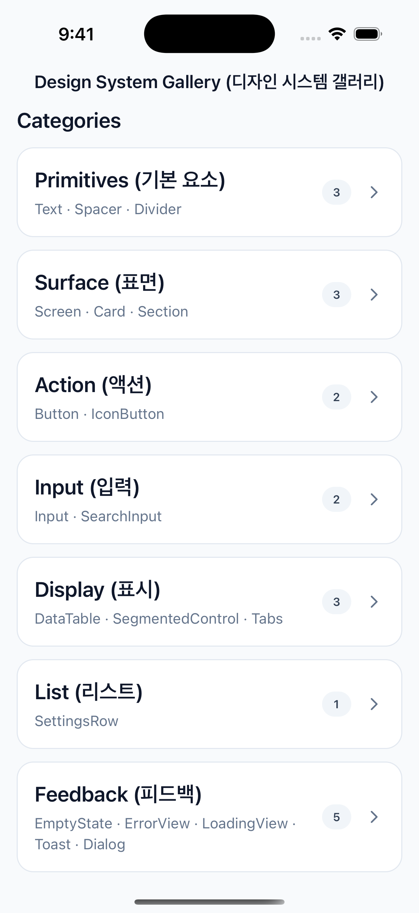 | 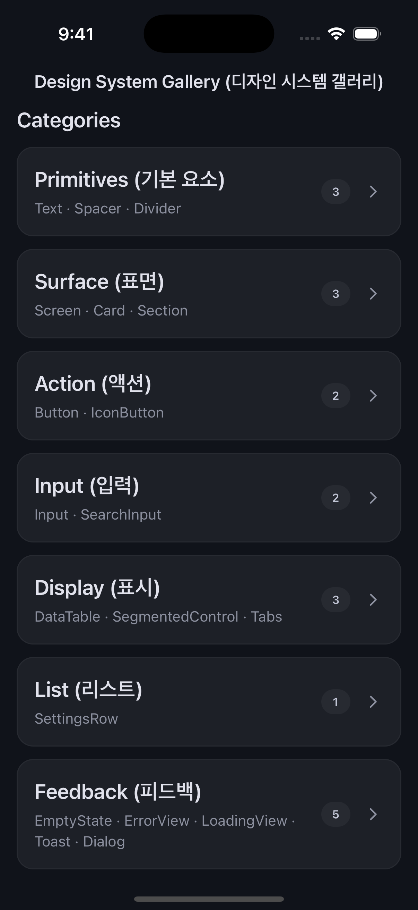 |

### Primitives — Text (텍스트)
| Light | Dark |
|:---:|:---:|
| 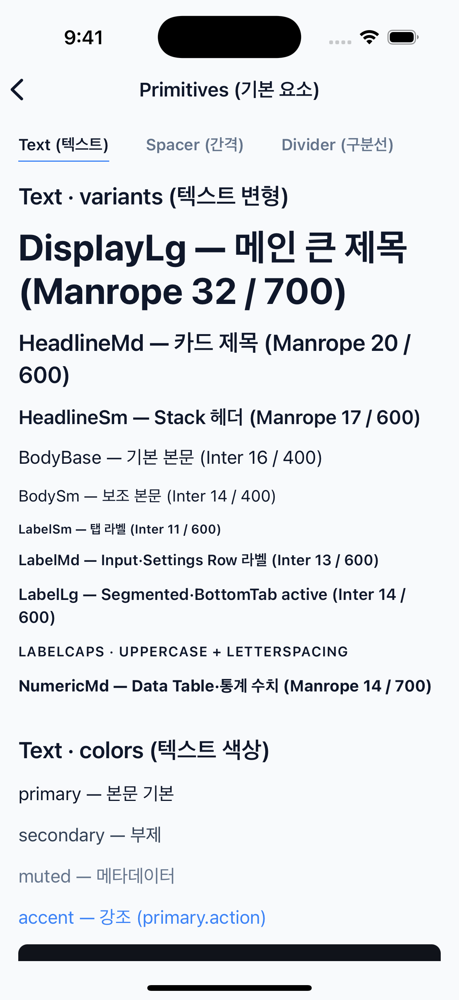 | 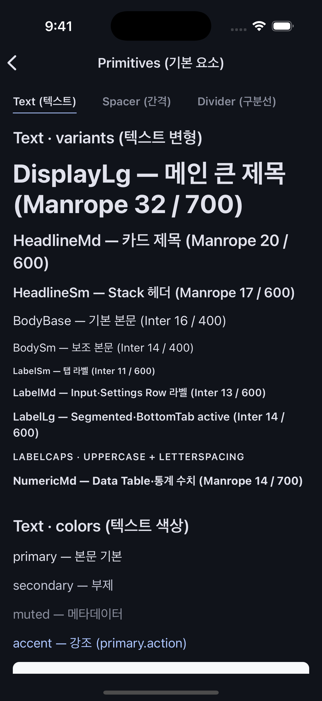 |

### Surface — Card (카드)
| Light | Dark |
|:---:|:---:|
|  |  |

### Action — Button (버튼)
| Light | Dark |
|:---:|:---:|
|  | 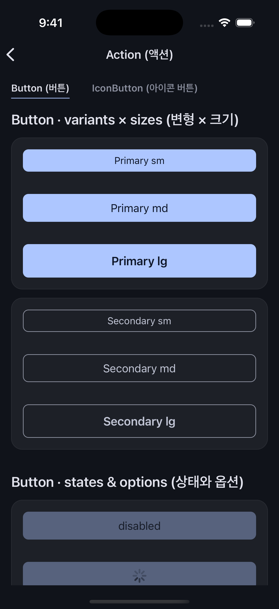 |

### Input — Input (입력)
| Light | Dark |
|:---:|:---:|
|  | 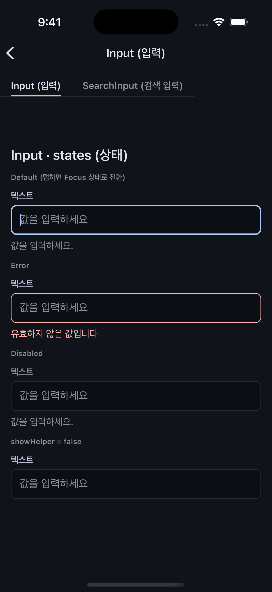 |

### Display — DataTable (데이터 테이블)
| Light | Dark |
|:---:|:---:|
| 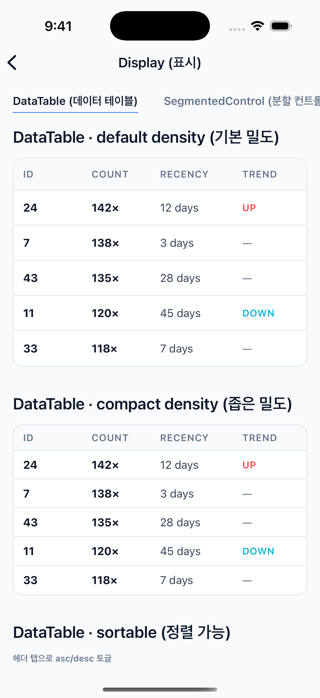 |  |

### Display — SegmentedControl (분할 컨트롤)
| Light | Dark |
|:---:|:---:|
| 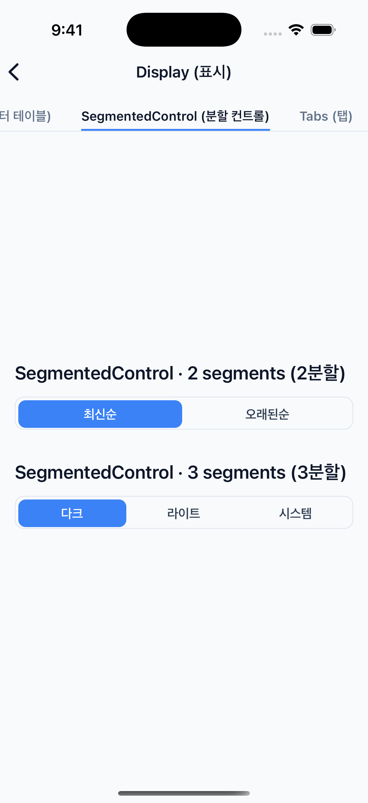 | 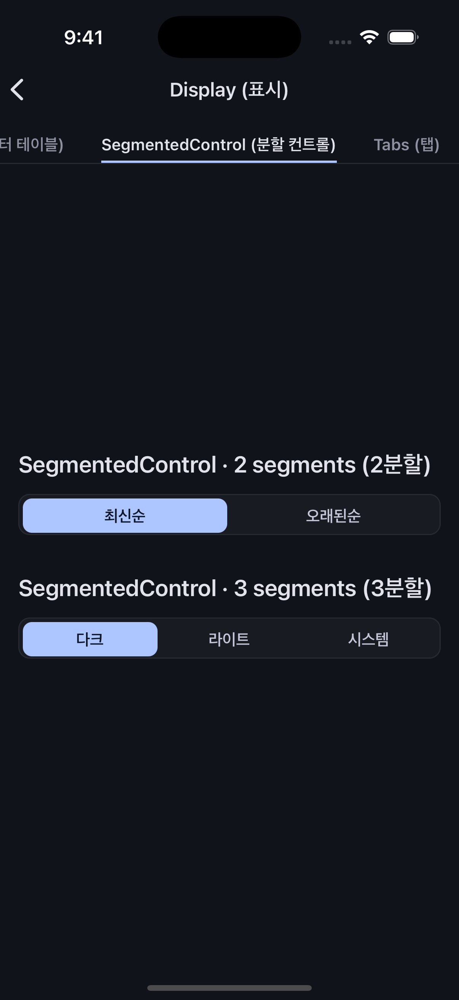 |

### Display — Tabs (탭)
| Light | Dark |
|:---:|:---:|
|  |  |

### List — SettingsRow (설정 행)
| Light | Dark |
|:---:|:---:|
| 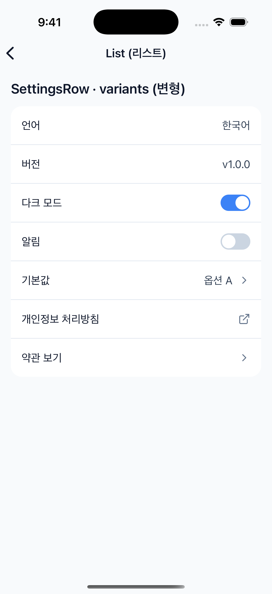 | 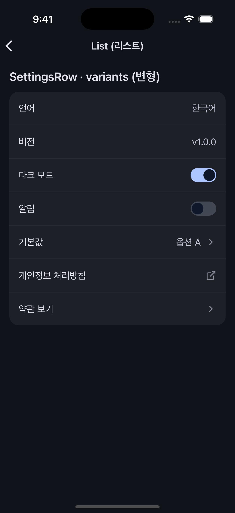 |

### Feedback — Toast (토스트)
| Light | Dark |
|:---:|:---:|
| 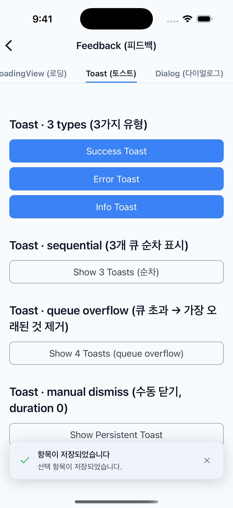 |  |

### Feedback — Dialog (다이얼로그)
| Light | Dark |
|:---:|:---:|
| 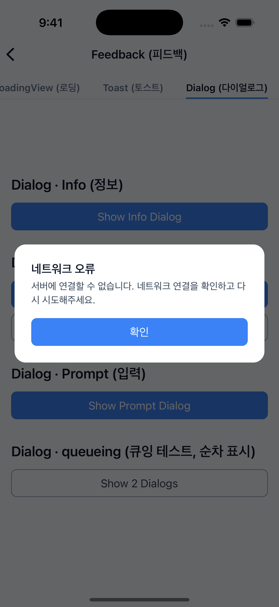 |  |

## Quick Start

```bash
git clone https://github.com/<your-account>/rn-design-system-starter.git
cd rn-design-system-starter
npm install
cd ios && pod install && cd ..
npm run ios      # 또는 npm run android
```

요구사항: Node.js 22.11+, Xcode 16+ (iOS), Android Studio + JDK 17+ (Android).

## 포함 컴포넌트 (22종, 7 카테고리)

| 카테고리 | 컴포넌트 | 설명 |
|---|---|---|
| **primitives** | `Text` | 타이포그래피 시스템 (11 variant, 5 color tone) |
| | `Spacer` | 표준화된 간격 컨트롤 (vertical·horizontal) |
| | `Divider` | 시각적 구분선 (subtle·default·strong) |
| **surface** | `Screen` | 안전 영역 + 표준 padding + 배경을 적용한 화면 컨테이너 |
| | `Card` | 컨텐츠 그룹화 표면 (제목·메타·구분선 옵션) |
| | `Section` | 페이지 내 시멘틱 섹션 컨테이너 |
| **action** | `Button` | 액션 버튼 (primary·secondary·destructive) |
| | `IconButton` | 아이콘 기반 액션 버튼 |
| **input** | `Input` | 라벨·헬퍼·에러 메시지 지원 텍스트 입력 |
| | `SearchInput` | 검색 아이콘 + 클리어 버튼이 있는 검색 입력 |
| | `Checkbox` | Material 3 둥근 사각형 체크박스 (3 size, label 옵션) |
| | `Radio` / `RadioGroup` | 정원형 라디오 + 그룹 컨테이너 (단일 선택 + 접근성) |
| **display** | `DataTable` | 타입 안전한 데이터 테이블 (정렬·밀도 옵션) |
| | `SegmentedControl` | 균등 분할 옵션 선택기 |
| | `Tabs` | Material 3 underline 가로 탭 |
| **list** | `SettingsRow` | 설정 화면용 행 (5가지 유형) |
| **feedback** | `EmptyState` | 빈 상태 표현 |
| | `ErrorView` | 오류 상태 표현 |
| | `LoadingView` | 로딩 상태 표현 |
| | `Toast` | 일시적 알림 메시지 (큐잉 + 자동 닫힘) |
| | `Dialog` | 모달 다이얼로그 (Promise 반환) |

## 기술 스택

| 영역 | 패키지 |
|---|---|
| **런타임** | React Native 0.85, React 19.2, TypeScript 5.8 |
| **스타일링** | styled-components/native 6.4 (DefaultTheme module augmentation) |
| **상태 관리** | Zustand 5 (Toast/Dialog 전역 호스트), TanStack Query 5 (서버 상태) |
| **네비게이션** | React Navigation 7 (`@react-navigation/native-stack`) — 예시 갤러리용 |
| **edge-to-edge** | `react-native-edge-to-edge` 1.8 (Android 15 status bar 통합) |
| **아이콘** | `lucide-react-native` 1.x + `react-native-svg` |
| **경로 별칭** | `babel-plugin-module-resolver` (`@/*` → `src/*`) |

## 사용 예시

### Text
```tsx
<Text variant="headlineMd" color="primary">최근 활동</Text>
<Text variant="bodySm" color="muted">2026-05-20</Text>
```

### Button
```tsx
<Button label="저장" variant="primary" onPress={handleSave} />
<Button label="삭제" variant="destructive" onPress={confirmDelete} />
```

### Card
```tsx
<Card title="개요" meta="이번 달" showDivider>
  <Text>카드 컨텐츠</Text>
</Card>
```

### Tabs
```tsx
import { Tabs } from '@/components/display';

const TABS = [
  { value: 'all', label: '전체' },
  { value: 'stats', label: '통계' },
];

const [active, setActive] = useState('all');

<Tabs tabs={TABS} value={active} onChange={setActive} />
```

### Checkbox
```tsx
import { Checkbox } from '@/components/input';

const [agreed, setAgreed] = useState(false);

<Checkbox value={agreed} onValueChange={setAgreed} label="약관에 동의합니다" />
<Checkbox value={agreed} onValueChange={setAgreed} size="lg" />
<Checkbox value disabled />
```

### Radio
```tsx
import { Radio, RadioGroup } from '@/components/input';

type Plan = 'free' | 'pro' | 'team';
const [plan, setPlan] = useState<Plan>('pro');

<RadioGroup value={plan} onValueChange={setPlan}>
  <Radio value="free" label="Free" />
  <Radio value="pro" label="Pro" />
  <Radio value="team" label="Team" disabled />
</RadioGroup>
```

## Toast & Dialog

### 마운트 (App 루트, 1회만)

```tsx
import { DialogHost, ToastHost } from '@/components/feedback';

export default function App() {
  return (
    <ThemeProvider theme={theme}>
      <SafeAreaProvider>
        <SystemBars style={isDark ? 'light' : 'dark'} />
        <NavigationContainer>
          <RootNavigator />
        </NavigationContainer>
        <DialogHost />
        <ToastHost />
      </SafeAreaProvider>
    </ThemeProvider>
  );
}
```

### Toast — 3가지 type, 자동 큐잉

```tsx
import { toast } from '@/stores/toastStore';

toast.success('저장 완료', '항목이 즐겨찾기에 추가되었습니다.');
toast.error('네트워크 오류', '연결을 확인해주세요.');
toast.info('새 데이터 도착');
```

- 한 번에 1개만 표시, 나머지는 큐(최대 3개)에 대기
- duration 기본 3000ms (`{ duration: 0 }`으로 수동 닫기 전용)
- 큐 초과 시 가장 오래된 항목 자동 제거

### Dialog — Promise 결과 반환

```tsx
import { dialog } from '@/stores/dialogStore';

// info — 단일 확인
await dialog.info({
  title: '네트워크 오류',
  description: '서버에 연결할 수 없습니다.',
});

// confirm — true/false 반환 (destructive 옵션)
const ok = await dialog.confirm({
  title: '항목 삭제',
  description: '되돌릴 수 없습니다.',
  destructive: true,
  confirmLabel: '삭제',
});
if (ok) deleteItem();

// prompt — string | null 반환
const value = await dialog.prompt({
  title: '회차 입력',
  placeholder: '예시',
});
if (value !== null) save(value);
```

## 설계 결정

각 컴포넌트와 토큰의 선택 근거, 포기한 대안은 [DECISIONS.md](DECISIONS.md) (Architecture Decision Records) 참고.

## License

MIT License — Copyright (c) 2026 pung
